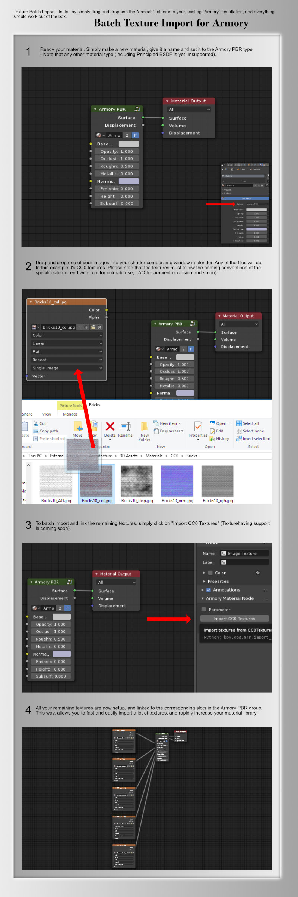

# Batch Texture Import
Batch Texture Import is, hence the name, a tiny addon to allow you to quickly import a lot of textures for your materials, for when working with Armory.

## What will come later?

I'm planning to include support for more sites, and more nodes. Eventually, I'll add support for importing several folders and set them up automatically.